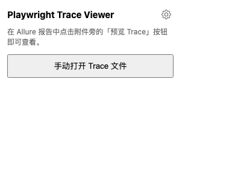
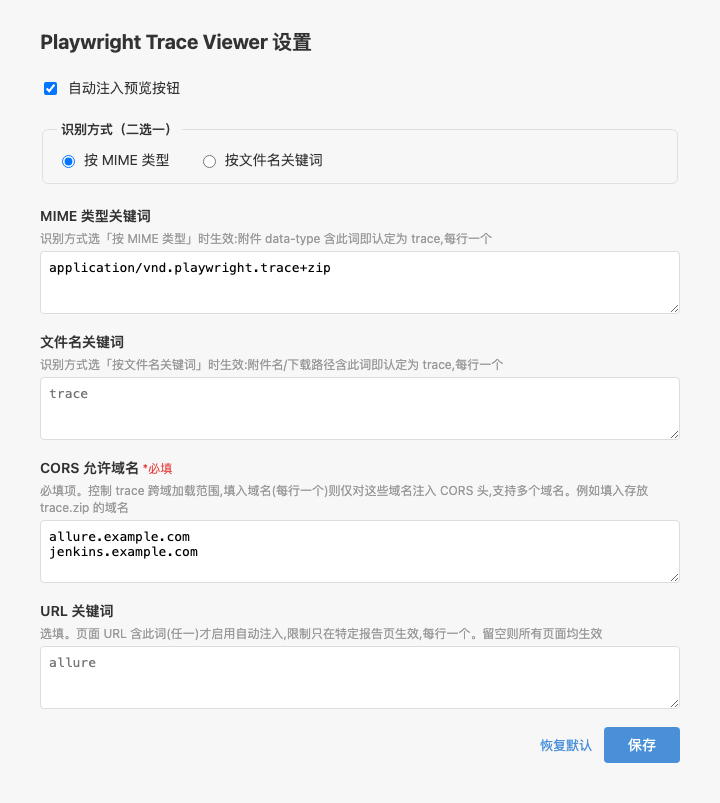

# Playwright Trace Viewer 安装与配置手册

## 目录

- [环境要求](#环境要求)
- [安装方式](#安装方式)
  - [方式一：从 Release 下载（推荐）](#方式一从-release-下载推荐)
  - [方式二：从源码构建](#方式二从源码构建)
- [加载扩展到 Chrome](#加载扩展到-chrome)
- [使用方式](#使用方式)
  - [在 Allure 报告中预览 Trace](#在-allure-报告中预览-trace)
  - [手动打开 Trace 文件](#手动打开-trace-文件)
- [配置说明](#配置说明)
  - [打开设置页](#打开设置页)
  - [设置项详解](#设置项详解)
- [自定义 MIME 类型注入（Python 示例）](#自定义-mime-类型注入python-示例)
- [常见问题](#常见问题)
- [卸载](#卸载)

---

## 环境要求

- **Chrome 浏览器** 或基于 Chromium 的浏览器（Edge、Brave 等），版本 110+
- **Node.js 20+**（仅从源码构建时需要）
- 需要访问的 Allure 报告页面（在线部署或本地 `file://` 均可）

---

## 安装方式

### 方式一：从 Release 下载（推荐）

1. 前往 [Releases 页面](https://github.com/ashj-yf/playwright-trace-viewer/releases)，下载最新版本的 `playwright-trace-viewer-vX.Y.Z.zip`。
2. 解压 zip 到任意目录（如 `~/extensions/playwright-trace-viewer/`）。
3. 参考下方 [加载扩展到 Chrome](#加载扩展到-chrome) 完成安装。

### 方式二：从源码构建

```bash
git clone https://github.com/ashj-yf/playwright-trace-viewer.git
cd playwright-trace-viewer
npm install   # 自动执行 prepare 脚本，同步官方 trace-viewer 产物
npm run build
```

构建产物在 `dist/` 目录，参考下方步骤加载该目录即可。

> **说明**：`npm install` 会通过 `scripts/sync-vendor.mjs` 自动从 `playwright-core` 同步官方 Trace Viewer 前端产物到 `public/vendor/trace-viewer/`，并对不兼容部分做兼容性 patch。该目录已被 `.gitignore` 忽略。

---

## 加载扩展到 Chrome

1. 打开 Chrome 浏览器，在地址栏输入 **`chrome://extensions`** 并回车。
2. 在页面右上角，打开 **「开发者模式」** 开关。
3. 点击左上角出现的 **「加载已解压的扩展程序」** 按钮。
4. 在弹出的文件选择对话框中，选择扩展目录：
   - 方式一用户：选择解压后的 zip 目录
   - 方式二用户：选择项目中的 `dist/` 目录
5. 加载成功后，扩展列表中会出现 **「Playwright Trace Viewer」**，工具栏右侧也会出现扩展图标。

> **提示**：建议将扩展图标固定到工具栏（点击拼图图标 🧩 → 找到 Playwright Trace Viewer → 点击图钉 📌），方便后续使用手动打开功能。

---

## 使用方式

### 在 Allure 报告中预览 Trace

1. 打开任意 Allure 测试报告页面（在线部署或本地 `file://` 打开的 `allure-report/index.html` 均可）。
2. 进入包含 Playwright trace 附件的用例详情页。
3. 附件名称旁会自动出现 **「▶ 预览 Trace」** 按钮。
4. 点击按钮，浏览器将在新标签页中打开完整的 Trace Viewer，在线加载并渲染该 trace。

> Trace Viewer 提供五个核心视图：**时间线**、**Screenshots**、**DOM 快照**、**Network**、**Console** 和 **Source**，与官方 `npx playwright show-trace` 体验一致。

### 手动打开 Trace 文件

如果你从其他渠道（如 CI 日志、同事分享）拿到了 `trace.zip`，可以不依赖 Allure 直接查看：

1. 点击浏览器工具栏的 **扩展图标**（需先固定到工具栏）。
2. 在弹出的 Popup 窗口中点击 **「手动打开 Trace 文件」**。



3. 新标签页打开后，将本地的 `trace.zip` 文件**拖拽**到页面中，即可在线预览。

---

## 配置说明

### 打开设置页

有两种方式进入设置页面：

- **方式一**：点击浏览器工具栏的扩展图标 → 点击 Popup 右上角的 **齿轮图标** ⚙️
- **方式二**：在 `chrome://extensions` 页面找到 Playwright Trace Viewer → 点击「详情」→ 点击「扩展程序选项」

设置页会在新标签页中打开：



> 修改设置后请务必点击底部的 **「保存」** 按钮，设置才会持久化生效。页面离开前如有未保存的更改，浏览器会弹出提醒。

### 设置项详解

| 设置项 | 说明 | 默认值 |
|--------|------|--------|
| **自动注入预览按钮** | 关闭后不在任何页面注入「预览 Trace」按钮。关闭后仍可通过 Popup 手动打开 trace 文件 | 开启 |
| **识别方式（二选一）** | 选择按 MIME 类型还是按文件名关键词来识别 trace 附件 | 按 MIME 类型 |
| **MIME 类型关键词** | 当识别方式为「按 MIME 类型」时生效。附件 `data-type` 属性包含任一关键词即判定为 trace，每行一个 | `application/vnd.playwright.trace+zip` |
| **文件名关键词** | 当识别方式为「按文件名关键词」时生效。附件名或下载路径包含任一关键词即判定为 trace，每行一个 | `trace` |
| **CORS 允许域名** ⚠️必填 | 控制跨域加载 trace 文件的域名范围。填入存放 trace.zip 的服务器域名（每行一个），扩展会为这些域名的请求注入 CORS 响应头。**留空将导致无法加载远程 trace** | 空（需手动填写） |
| **URL 关键词** | 选填。页面 URL 包含任一关键词时才启用自动注入，用于限制只在特定报告页面生效。留空则对所有页面生效 | `allure` |

#### 识别方式详解

- **按 MIME 类型**（推荐）：Allure 报告中的附件带有 `data-type` 属性。Playwright 生成的 trace 附件 MIME 类型为 `application/vnd.playwright.trace+zip`。此模式下，只有当附件的 MIME 类型包含你配置的关键词时，才会显示预览按钮。这是最精确的识别方式，推荐使用。

- **按文件名关键词**：按附件文件名或下载路径匹配。如果附件名或路径包含你配置的关键词（如 `trace`、`playwright`），则显示预览按钮。适合 MIME 类型不标准或使用自定义报告的场景。

#### CORS 允许域名配置示例

假设你的 Allure 报告部署在 `https://allure.company.com`，trace 文件也存放在同一域名下，则 CORS 允许域名填写：

```
allure.company.com
```

如果有多个域名存放 trace 文件（如不同环境的 Jenkins），每行一个：

```
jenkins-ci.example.com
jenkins-staging.example.com
allure.company.com
```

> **为什么需要配置 CORS 域名？**  
> 扩展内嵌的 Trace Viewer 是一个独立的 Service Worker，它需要跨域 fetch trace.zip 文件。浏览器默认禁止跨域请求，扩展通过 `declarativeNetRequest` API 为匹配的域名动态注入 `Access-Control-Allow-Origin` 等响应头来解决此限制。因此需要你明确指定哪些域名允许跨域加载。

---

## 自定义 MIME 类型注入（Python 示例）

插件默认按 MIME 类型识别 trace 附件。如果 Allure 附件未带正确的 MIME 类型，可在 Python 测试代码中用 `allure.attach.file()` 显式指定 `attachment_type`：

```python
import allure

PLAYWRIGHT_TRACE_MIME = "application/vnd.playwright.trace+zip"

# 将 trace.zip 以自定义 MIME 类型附加到 Allure 报告
allure.attach.file(
    source="trace.zip",
    name="execution",
    attachment_type=PLAYWRIGHT_TRACE_MIME,  # 自定义 MIME 类型
    extension="zip",
)
```

然后在插件设置页将「识别方式」设为 **按 MIME 类型**，MIME 类型关键词填入 `application/vnd.playwright.trace+zip`（与代码中一致即可）。

---

## 常见问题

### Q: 为什么我在 Allure 页面看不到「预览 Trace」按钮？

请按以下步骤排查：

1. **检查自动注入是否开启**：进入设置页，确认「自动注入预览按钮」开关处于开启状态。
2. **检查 URL 关键词配置**：设置页中的「URL 关键词」默认为 `allure`。如果你的 Allure 报告 URL 不含此关键词，请修改或清空该配置。例如报告地址为 `http://localhost:8080/report/`，URL 中不含 `allure`，则需将 URL 关键词改为 `report` 或直接留空。
3. **检查识别方式**：确认附件的 MIME 类型或文件名是否匹配你配置的关键词。
4. **确认页面是 Allure 用例详情页**：按钮仅在展开的测试用例详情页的附件旁注入，不会出现在用例列表页。

### Q: 点击预览按钮后 trace 一直加载不出来？

1. **检查 CORS 允许域名是否已配置**：进入设置页，确认「CORS 允许域名」中已填写存放 trace.zip 的服务器域名。**这是必须配置的项**，留空会导致跨域加载失败。
2. **检查保存后是否重新加载**：修改 CORS 配置并保存后，刷新 Allure 报告页面再试。
3. **检查 trace 文件是否可访问**：在浏览器中直接访问 trace.zip 的 URL，确认文件存在且可以下载。

### Q: 能否在内网/离线环境使用？

**可以。** 扩展将所有核心资源（官方 Trace Viewer 前端）打包在内，不依赖任何外部 CDN。只要你能访问 Allure 报告页面和 trace 文件（即使在内网），扩展就能正常使用。**数据全程在浏览器本地处理，不会上传到任何外部服务。**

### Q: 支持哪些浏览器？

本扩展基于 Chrome Manifest V3 开发，支持所有基于 Chromium 的现代浏览器：

- **Google Chrome** 110+
- **Microsoft Edge** 110+
- **Brave**、**Opera**、**Vivaldi** 等 Chromium 内核浏览器

Firefox 和 Safari 暂不支持。

### Q: 如何更新到最新版本？

- **方式一用户**：前往 [Releases 页面](https://github.com/ashj-yf/playwright-trace-viewer/releases) 下载最新 zip，解压覆盖原目录，然后在 `chrome://extensions` 点击扩展卡片上的刷新图标 🔄。
- **方式二用户**：`git pull` 拉取最新代码后，重新执行 `npm install && npm run build`，然后在 `chrome://extensions` 刷新扩展。

### Q: 本地 `file://` 协议打开的 Allure 报告能用吗？

**可以。** 扩展对 `file://` 协议打开的 `allure-report/index.html` 同样有效。但请注意，如果 trace.zip 也存储在本地，Trace Viewer 可能因浏览器安全策略无法加载本地文件。建议将 trace.zip 托管在本地 HTTP 服务器上。

---

## 卸载

1. 打开 Chrome，访问 `chrome://extensions`。
2. 找到 **「Playwright Trace Viewer」**。
3. 点击 **「移除」** 按钮，确认移除即可。

扩展的所有本地数据（设置、缓存）将一并清除。
